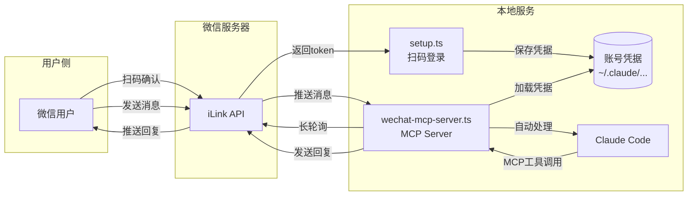
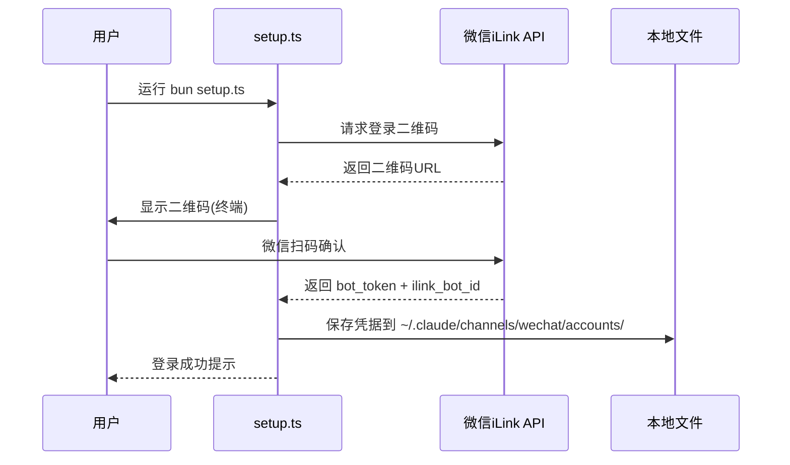
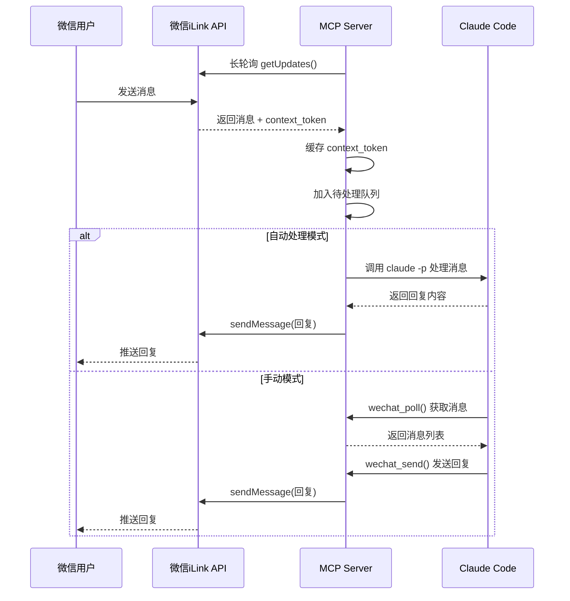
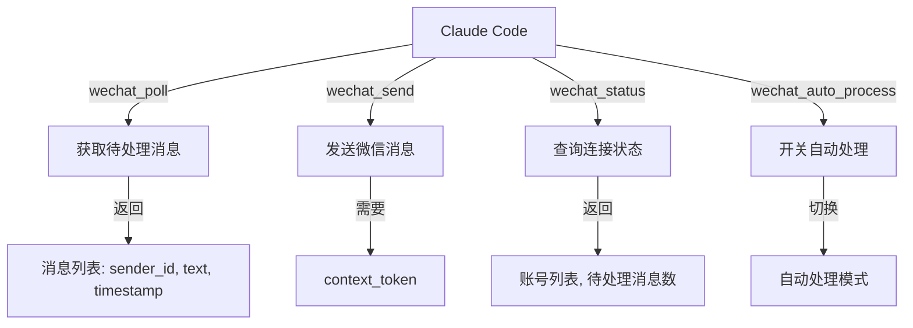

# WeChat MCP Server 使用说明

## 项目简介

**wechat-mcp-claude** 是一个微信消息桥接工具，通过 MCP (Model Context Protocol) 协议让 Claude Code 直接与微信交互。

## 架构图

### 整体架构



### 登录流程



### 消息处理流程



### MCP 工具调用



**核心流程说明：**

| 阶段 | 说明 |
|------|------|
| 登录 | 通过 `setup.ts` 扫码获取 token，保存到本地 |
| 轮询 | MCP Server 长轮询微信 API 获取新消息 |
| 处理 | 自动模式：调用 Claude CLI 处理；手动模式：通过 MCP 工具调用 |
| 回复 | 使用 `context_token` 发送回复消息 |

## 功能特性

- **多账号支持**：可配置多个微信账号
- **自动处理**：收到消息后自动调用 Claude CLI 处理并回复
- **MCP 工具集成**：提供标准 MCP 工具接口

## 环境要求

- **Bun** >= 1.0.0
- **Claude CLI** (用于自动处理消息)

## 快速开始

### 1. 安装依赖

```bash
bun install
```

### 2. 配置微信账号

```bash
# 交互式管理（推荐）
bun setup.ts

# 直接添加新账号
bun setup.ts --add work

# 列出所有已配置账号
bun setup.ts --list

# 删除账号
bun setup.ts --delete work
```

扫码登录后，凭据保存在 `~/.claude/channels/wechat/accounts/{name}.json`

### 3. 配置 MCP

在项目根目录的 `.mcp.json` 中配置：

```json
{
  "mcpServers": {
    "wechat-bridge": {
      "command": "bun",
      "args": ["./wechat-mcp-server.ts"]
    }
  }
}
```

### 4. 启动方式

**方式一：作为 MCP Server 集成（推荐）**

启动 Claude Code 后，MCP Server 会自动加载，你即可使用以下工具。

**方式二：直接启动**

```bash
# 使用默认账号启动
bun wechat-mcp-server.ts

# 指定账号启动
WECHAT_ACCOUNT_NAME=work bun wechat-mcp-server.ts
```

## MCP 工具列表

| 工具名 | 描述 |
|--------|------|
| `wechat_poll` | 获取待处理的微信消息 |
| `wechat_send` | 发送微信消息给指定用户 |
| `wechat_status` | 获取连接状态和统计信息 |
| `wechat_auto_process` | 启用/禁用新消息自动处理 |

## 使用示例

```
# 获取待处理消息
wechat_poll(max_count=10)

# 发送消息
wechat_send(sender_id="user_id", text="回复内容")

# 查看状态
wechat_status()

# 启用/禁用自动处理
wechat_auto_process(enabled=true)
```

## 多账号配置

支持通过环境变量指定账号：

```bash
# 指定账号名称
WECHAT_ACCOUNT_NAME=work bun wechat-mcp-server.ts

# 指定账号文件路径
WECHAT_ACCOUNT_FILE=~/.claude/channels/wechat/accounts/work.json bun wechat-mcp-server.ts
```

## 文件结构

```
wechat-mcp-claude/
├── .mcp.json              # MCP 配置文件
├── package.json           # 项目依赖
├── setup.ts               # 账号管理/扫码登录工具
└── wechat-mcp-server.ts   # MCP Server 主程序
```

## 凭据存储

账号凭据保存在：
```
~/.claude/channels/wechat/accounts/{账号名}.json
```

## License

MIT
